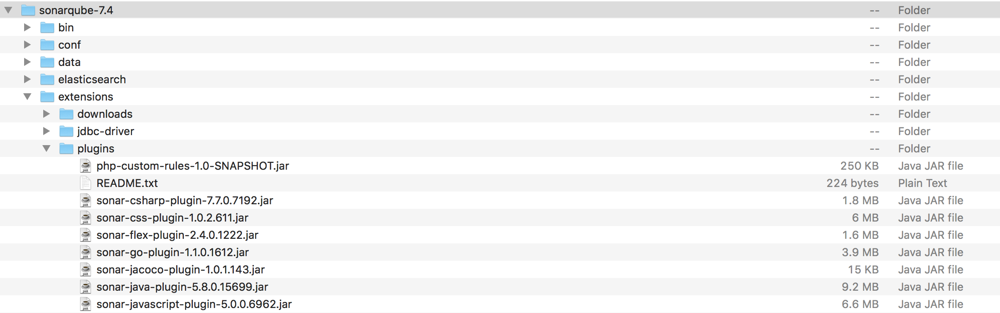
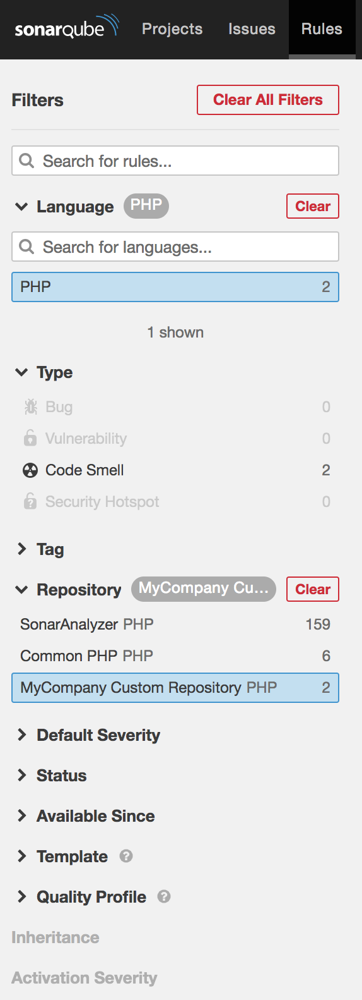
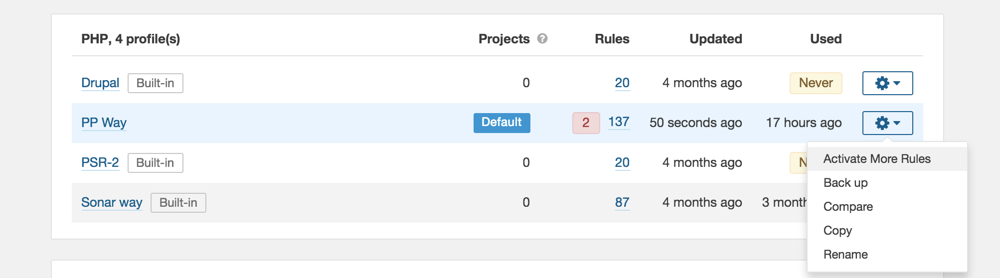
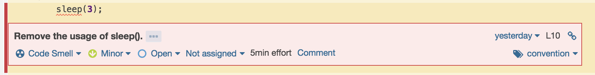

# SonarQube PHP Custom Rules

Rules are written in Java :) - requirements:
1. Install [IntelliJ IDEA](https://www.jetbrains.com/idea/) (or any similar editor but this one is free & by JetBrains)
2. Plugin itself need to be [Maven](http://maven.apache.org/guides/getting-started/index.html) plugin or [Learn2Code](https://www.learn2code.sk/kurzy/online-kurz-maven) but this documentation is less important

## Maven - Basic principle

Maven is project management tool that allows
 - define dependencies
 - define what to build (target, in this case PHP custom rule)
 - using TDD built software artifact - **jar** file with custom rules


## Install your Plugin

 - copy **jar** file from **target** directory (it is where IntelliJ puts compiled files) into **sonar-server/extensions/plugins**

 - restart SonarQube server
 - new rules are in your Repository

 - activate new rules in standard way

 - **warning!** Rules can be deactivated after you update (reinstall) plugin


# Custom PHP Rules
## Useful links

Everything for SonarQube developers: <https://docs.sonarqube.org/display/DEV>

Page about Custom PHP rules: <https://docs.sonarqube.org/display/PLUG/Custom+Rules+for+PHP>

Example PHP Rules (our repository is build on this example) <https://github.com/SonarSource/sonar-custom-rules-examples/tree/master/php-custom-rules>

Step-by-Step tutorial for Java <https://docs.sonarqube.org/display/PLUG/Writing+Custom+Java+Rules+101> (imho some steps are skipped)

### Official SonarQube GitHub

Useful constants for PHP: <https://github.com/SonarSource/sonar-php/blob/master/php-frontend/src/main/java/org/sonar/plugins/php/api/tree/Tree.java>

Source code of PHP rules: <https://github.com/SonarSource/sonar-php/tree/master/php-checks/src/main/java/org/sonar/php/checks>

## @Rule annotation
There are more elements but common used are:
```java
@Rule(
    key = className.KEY,
    priority = Priority.MAJOR,  // priority: INFO, MINOR, MAJOR, CRITICAL, BLOCKER
    name = "Name displayed in SonarQube server",
    tags = {"confusing", "pitfall"}  // list of tags
)
```

## Tests based on PHP files
Your rules are validation against real PHP files. Look at example below how to mark lines with wrong code.

### Expecting issue - NOK
```php
class DefaultController extends Controller
{
    public function sleepAction(int $delay)
    {
        sleep($delay); // NOK
    }
}
```

### Expecting issue with specified message - NOK {{message}}
```php
class DefaultController extends Controller
{
    public function sleepAction(int $delay)
    {
        sleep($delay); // NOK {{Remove the usage of sleep().}}
    }
}
```



### Expecting issue on other line - NOK@+offset
```php
class DefaultController extends Controller
{
    public function sleepAction(int $delay)
    {
        // NOK@+1
        sleep($delay); 
    }
}
```

### Expecting multiple issues on one line
Message is compulsory (probably, cannot figure out other way) - your are raising two issues on line with **if** statement

```php
// NOK@+2 {{first message}}
// NOK@+1 {{second message}}
if ($a) {

}
```